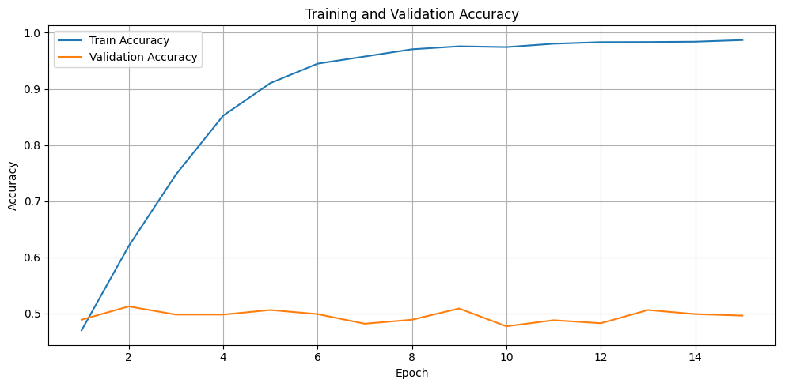
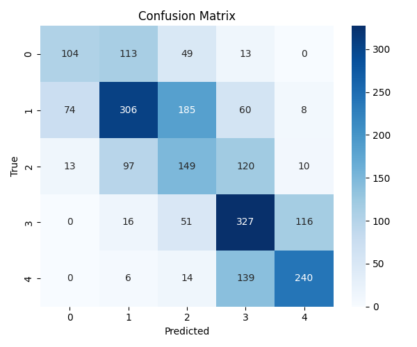
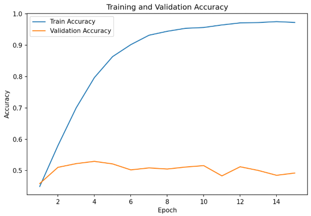
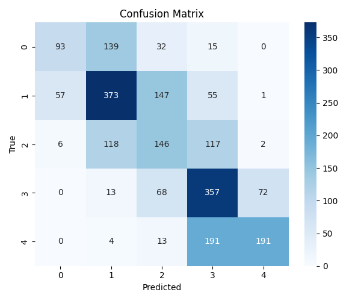

# Name of involved team member
- Abdulrahman Omar Mohsen (abdm)
- Markus Æbelø Faurbjerg (mfau)

# Central problem, domain, data characteristics
**Central problem**: Sentiment Analysis 

**Domain**: Movie reviews - Stanford Sentiment Treebank - Fine-Grained (https://huggingface.co/datasets/SetFit/sst5) 

**Data characteristics**: A review of a movie and an associated human-labeled sentiment.\
Sentiments range from very negative to very positive.\
Each data point consists of a string and a int64.

# Central method
**Architecture**: BERT.

**Training mechanism**:
* Load the pre-trained BERT-base-uncased
* The base model extracts a CLS token from BERT's final hidden state.
This token is passed through a linear classifier that maps from the 768-dimensional embedding to the 5 sentiment classes in SST-5.

* Loss: Cross-entropy loss
* Optimizer: AdamW

* Training happens over multiple epochs, using a separate validation set to track loss and and accuracy.

# Key experiments and results
**Results**:
* Base model: Initial accuracy of 50.09%.
Fine-tuning over 15 epochs did not increase performance by a noteworthy amount and caused increasingly bad overfitting.

  
  

  

We experimented with multiple different models, trying to increase test accuracy and decrease overfitting.
Despite a dozen attempts we did not achieve notable performance increases beyond the base model.
The highest performing model was the V4 model, which achieved 52.49% test accuracy.

The V4 model uses multiple Dropout layers, which can help reduce overfitting. \
Additionally, it uses GELU instead of RELU, which we tried in model V2 and V3. 

  
  

  

**Explanation of results**:\
As of February 2025, SOTA performance is 60.48% with BERT on sst-5 ([https://arxiv.org/abs/2502.20682](https://arxiv.org/abs/2502.20682)).

Performance of BERT is much higher on the [SST-2](https://huggingface.co/datasets/stanfordnlp/sst2) dataset. 
The original BERT paper from [Devlin et al., 2019](https://arxiv.org/abs/1810.04805) achieved 93.5% accuracy on SST-2. \
There are multiple contributing factors to this. The [SST-2](https://huggingface.co/datasets/stanfordnlp/sst2)
dataset has 67.349 data points for training, where [SST-5](https://huggingface.co/datasets/SetFit/sst5) has only 8.544 data points for training. \
Additionally, the SST-2 dataset is much less fine-grained with only two labels: positive and negative.\
The larger dataset means that the BERT model can generalize better, reducing overfitting.
The less fine-grained data is a less demanding task, since crucial keywords can carry more weight in decisionmaking.\
This challenge is evident from the confusion matrices for both models.
The models correctly distinguish between positive and negative sentiments, but fail to accurately distinguish between very positive vs positive and positive vs neutral sentiments. 

These fundamental challenges are a key component of why we struggled to increase performance beyond what a baseline model implementation can provide.

# Discussion
- Most important results (Easy baseline performance - Hard to otimize, why?)
- What is good? Pipeline works well
- What can be improved? (Adding techniques from Nkhata paper)

- Lessons learned
    - Pipeline becomes important when iterating models
    - Being familiar with SOTA performance important before chasing 9's in performance metrics
    - Dataset size
    - Granularity of data  